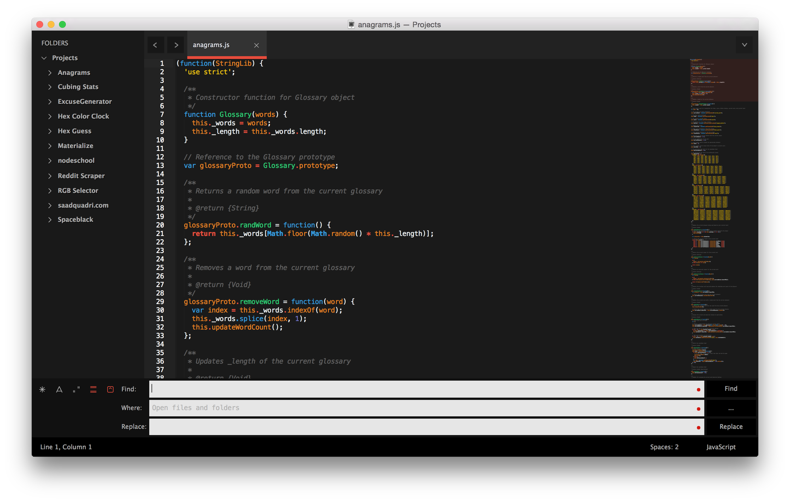

If you're reading this, you have probably made the decision to use Sublime Text as your editor. Smart choice! Sublime is an amazing editor that is very lightweight, incredibly fast, and highly extendible. It provides a slick interface that is easily customizable and offers IDE-like features.

A few of the awesome features that Sublime Text offers:

* Multiple cursors/selections
* Split editing
* Goto files/symbols/line numbers
* Distraction Free Mode
* Command Palette
* Plugin API
* Vintage mode
* Fuzzy Searching

This will be a guide on getting started with Sublime Text and learning how to customize it. Let's get started.

## Download/Installation
There are currently two versions of Sublime, ST2 and ST3. I highly recommend choosing Sublime Text 3 as it has a lot of new features and supports more plugins. Don't be fooled by the fact that it is in "beta" – ST3 is just as stable as ST2 (if not more).

Head over to the main [Sublime Text download page](http://www.sublimetext.com/3) and click on the OS you are using (Windows, OS X, etc). This should start the download for you. Once the file is done downloading, open the folder and install the editor. You should be all set.

## Opening Files and Folders
If you're on a Mac, you can just open folders and files the same way by doing *File -> Open* in the menu bar, or by pressing <kbd>⌘</kbd>+<kbd>O</kbd>. Choose the folder or file you want to open, and then press <kbd>Enter</kbd>. This will open the folder/file for you in the editor and you can see it in the sidebar as well.

If you're on Windows, there are seperate options for folders and files. Files can be opened by doing *File -> Open File*, or by doing <kbd>Ctrl</kbd>+<kbd>O</kbd>. If you want to open an entire folder, you can do *File -> Open Folder* in the menu bar.

Regardless of your OS, another way to open a file or folder is to simply drag the file/folder into the window. Doing so will produce the same result:


## Installing Package Control

Open up Sublime Text. Before we start customizing, we will need to install Package Control which is the awesome package manager for Sublime. It makes it very easy to install plugins, color schemes, themes, etc.

Go to the [Package Control installation page](https://packagecontrol.io/installation). On the left side of the page, you should see a box with two tabs on it, one for ST3 and one for ST2. Make sure *Sublime Text 3* is selected, and then copy all the code inside the box.

Now, go back to Sublime. We will need to paste that code into the Sublime Text console in order to get Package Control installed. You can open up the console by pressing <kbd>Control</kbd>+<kbd>`</kbd>. Once that is opened, paste the code into the input field and press <kbd>Enter</kbd>. This should start the installation:


Once the installation is complete, you will need to restart Sublime Text. After you open it again, Package Control will be available for use and you can start installing some plugins.

## Installing Packages

Let's try out Package Control by installing a new theme. To use Package Control's commands, we will need to open up the Command Palette. The Command Palette is a built-in feature that Sublime has that lets you perform actions from the menu bar right from the keyboard.

If you're on a Mac, you can open up the Command Palette with <kbd>⌘</kbd>+<kbd>Shift</kbd>+<kbd>P</kbd>.

If you're on Windows, it would be <kbd>Ctrl</kbd>+<kbd>Shift</kbd>+<kbd>P</kbd>.

Once you have it open, you will see a list of available commands show up. We want to install a package, so let's type in `Package Control: Install Package` and then press <kbd>Enter</kbd>.

A huge list of available packages will show up. Let's download the "Brogrammer" theme for this example. Type in `Theme - Brogrammer` and press <kbd>Enter</kbd>. The theme will now begin installing.

## Changing Your Theme and Color Scheme

The UI for Sublime can be split into two parts – a theme and a color scheme. The color scheme only sets the syntax highlighting and the background color of the editor. Everything else (the sidebar, the tabs, the search bar, quick panels, etc) is set by the theme. You can see it visualized here:


Only the part inside the green box is affected by the color scheme. The rest is changed from the theme.

We downloaded `Brogrammer`, which contains both a theme and a color scheme. We can manually set our color scheme and theme by putting the correct path in our user settings file, but there is an easier way. We are going to install two plugins, `Themr` and `Schemr` which will make it very easy to change our theme and color scheme at will.

Open up the Command Palette, and once again do `Package Control: Install Package`, and press <kbd>Enter</kbd>. Type in `Themr` and press <kbd>Enter</kbd>. Repeat this process to install `Schemr`.

Now that you have `Themr` and `Schemr` installed, let's use them to switch to Brogrammer.

Open up the Command Palette and type in `Themr: List themes`. This will bring up a list of themes that you have installed. Use the arrow keys to choose `Brogrammer`, and press <kbd>Enter</kbd>. Next, open up the command palette again and type in `Schemr: List all schemes`. Choose `Brogrammer` and press <kbd>Enter</kbd>. You now have Brogrammer set as your theme and color scheme.

**Note:** Whenever you change your theme, you will need to restart Sublime Text.

As you can see, the theme and color scheme change have taken effect when we reopen the editor:



You can go to the [Package Control website](https://packagecontrol.io/) to find a full listing of available [color schemes](https://packagecontrol.io/browse/labels/color%20scheme) and [themes](https://packagecontrol.io/browse/labels/theme) you can install.

## Customizing Your Editor
All of your user preferences will be done in your `Preferences.sublime-settings` file which can be found by going to *Preferences -> Settings – User*. Right now, your file will most likely look something like this:

```json
{
  "color_scheme": "Packages/Theme - Brogrammer/brogrammer.tmTheme",
  "ignored_packages":
  [
    "Vintage"
  ],
  "theme": "Brogrammer.sublime-theme"
}
```

There are many options you can add to this file, based on your preferences. You can go to *Preferences -> Settings – Default* to see a full listing of the available options you can use.

**Note:** All of your preference changes should be done in the User file, not the default file. Only use the default file as a reference to see what options you can add.

Here are the preferences that I use:

```json
{
  "always_show_minimap_viewport": true,
  "auto_complete": true,
  "auto_complete_commit_on_tab": true,
  "auto_complete_selector": "source, text",
  "auto_complete_triggers":
  [
    {
      "characters": ".",
      "selector": "source, text.html"
    }
  ],
  "caret_extra_width": 5,
  "caret_style": "solid",
  "color_scheme": "Packages/User/SublimeLinter/Material Spacegray (SL).tmTheme",
  "font_face": "Fira Mono",
  "font_options":
  [
    "gray_antialias"
  ],
  "font_size": 12,
  "highlight_line": true,
  "icon_file_type_enable": true,
  "ignored_packages":
  [
  ],
  "indent_guide_options":
  [
    "draw_normal",
    "draw_active"
  ],
  "line_padding_bottom": 1,
  "line_padding_top": 1,
  "overlay_scroll_bars": "enabled",
  "remember_open_files": true,
  "tab_size": 2,
  "theme": "Material Spacegray.sublime-theme",
  "translate_tabs_to_spaces": true,
  "trim_trailing_white_space_on_save": true,
  "wide_caret": true,
  "word_wrap": true,
}
```

and here is what my editor looks like:


The theme and color scheme in the screenshot are called *Material Spacegray*, a custom theme/scheme that I made. You can find it in Package Control by installing the `Materialize` package.

## Creating Custom Keyboard Shortcuts
Modifying your key bindings is similar to modifying your user preferences. There are two files, one default and one user. You will want to make changes to the user file. Open up your user keybindings by going to *Preferences -> Key Bindings – User*. Open up the default keybindings by going to *Preferences -> Key Bindings – User*. Whenever you want to change a keybinding in the default file, you can copy the line from the default file into your user file and then change the keys.

For example, let's say we wanted to be able to toggle the sidebar by pressing <kbd>Control</kbd> + <kbd>Shift</kbd> + <kbd>Space</kbd>. To do this, we would first look for the appropriate command name inside the default file. This is what the default file looks like at the top:

```json
[
  { "keys": ["super+shift+n"], "command": "new_window" },
  { "keys": ["super+shift+w"], "command": "close_window" },
  { "keys": ["super+o"], "command": "prompt_open" },
  { "keys": ["super+shift+t"], "command": "reopen_last_file" },
  { "keys": ["super+alt+up"], "command": "switch_file", "args": {"extensions": ["cpp", "cxx", "cc", "c", "hpp", "hxx", "hh", "h", "ipp", "inl", "m", "mm"]} },
  { "keys": ["super+n"], "command": "new_file" },
  { "keys": ["super+s"], "command": "save" },
  { "keys": ["super+shift+s"], "command": "prompt_save_as" },
  { "keys": ["super+alt+s"], "command": "save_all" },
  { "keys": ["super+w"], "command": "close" },

  { "keys": ["super+k", "super+b"], "command": "toggle_side_bar" },
  { "keys": ["super+ctrl+f"], "command": "toggle_full_screen" },
  { "keys": ["super+ctrl+shift+f"], "command": "toggle_distraction_free" },
  ...
```

**Note:** The keys may be slightly different in Windows.

As you can see, the key binding for toggling the sidebar is being set in line 13. Copy that entire line and put it into your User keybindings. Next, change the keys to be set to <kbd>Control</kbd> + <kbd>Shift</kbd> + <kbd>Space</kbd>.

Your User keybindings file should look like this:

```json
[
    { "keys": ["ctrl+shift+space"], "command": "toggle_side_bar" }
]
```

Test it out and make sure it works.

Obviously, scrolling through the default keybindings file is probably not the best way to find a command name, as that could take a really long time. There is a neat trick you can use to find the command name of the action you want to set a keyboard shortcut for.

Open up the sublime console with <kbd>Control</kbd>+<kbd>\`</kbd> and type in `sublime.log_comands(True)`. Now, whenever you perform an action, the command name will be printed inside the console. Once you've got the name of the command you want, you can stop the printing by doing `sublime.log_commands(False)`.

## Recommended Packages
Here is a list of some great packages that I highly recommend you to install:

* **AdvancedNewFile** – Faster file creation within a project
* **BracketHighlighter** – Bracket matching for `[]`, `()`, `{}`, `""`, and tags
* **DocBlockr** – Comment generator for various languages
* **Emmet** – Greatly improves HTML and CSS workflow
* **Origami** – tmux-like pane creator
* **PackageResourceViewer** – Extracts installed packages for you so you can see the source files/folders of any
package you install
* **Schemr/Themr** – Easily switch your color scheme and theme
* **SidebarEnhancements** – Enhanced features for your sidebar
* **SublimeLinter** – Code linting for many languages

## Further Learning
I highly recommend going through Jeffrey Way's [Perfect Workflow in Sublime Text](http://code.tutsplus.com/articles/perfect-workflow-in-sublime-text-free-course--net-27293) course. You just need to make a free account and then you will be able to watch the videos. He goes through all of the best features of Sublime Text and teaches you how to optimize and perfect your workflow.
